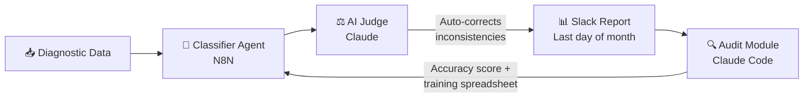
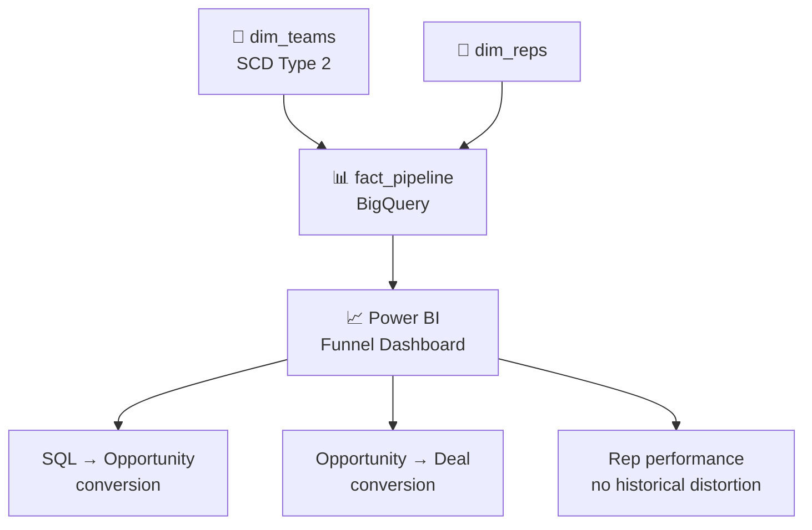

# Helena Callado

### Analytics Engineer · Revenue Operations · AI & DataOps Automation

*I don't build dashboards. I build systems that turn data into decisions — and decisions into revenue.*

---

## About Me

I'm an Analytics Engineer working at the intersection of data infrastructure and revenue operations. At **Asksuite** — a global B2B SaaS platform for the hospitality sector — I own the full data stack: from pipeline architecture and data modeling to AI-powered automations that drive business outcomes across international markets.

My work spans data engineering, BI, and GTM automation, always with a revenue lens. I model data in BigQuery, build self-improving pipelines with N8N and Claude, redesign dashboards with correct historical modeling, and ship GTM tooling that cuts days of manual work down to hours. I work closely with Sales, CS, and Product teams in markets across Latin America, North America, and Europe.

What differentiates my approach is the combination of engineering rigor with business context. I don't just automate tasks — I design systems that audit themselves, improve over time, and connect directly to metrics that matter: MRR, NRC, churn, and pipeline conversion.

Before data, I taught martial arts. That background shows up in how I work: methodical, iterative, and focused on long-term fundamentals over short-term fixes.

---

## Tech Stack

**Languages & Query**

**Data Modeling & Transformation**

**Cloud & Warehouses**

**BI & Analytics**

**Automation & AI**

**DevOps & Version Control**

---

## Projects

### 🔁 Churn Report Automation — N8N + Claude Code

> [!IMPORTANT]
> Eliminated a 5-day manual process and replaced it with a self-improving monthly pipeline — no human intervention required after deploy.

**Stack:** N8N · Claude · Slack API · Google Sheets

**The system flow:**

📋 Full technical details

**Problem:** The churn report took up to 5 days to complete, relying on manual classification of customer diagnostics.

**Solution:**
- **Classifier Agent** (N8N): reads diagnostic data and maps churn drivers automatically
- **AI Judge** (Claude): reviews outputs and auto-corrects inconsistencies before delivery
- **Output**: delivered to Slack every last day of the month with saver funnel, top drivers, executive summary, and MoM analysis

**Self-improvement layer:** An audit module via Claude Code calculates classification accuracy, surfaces errors, and generates a training spreadsheet — the system gets smarter with every cycle without human intervention.

**Result:** Eliminated recurring manual work. Built a closed feedback loop that continuously improves model accuracy.

---

### 🧩 Clay AI — GTM Engineering & Demand Generation

> [!IMPORTANT]
> Proposed and implemented Clay AI for the GTM stack. Reduced demand generation cycle from **7 days to 1 day**.

**Stack:** Clay AI · N8N · BigQuery · Google Sheets

📋 Full technical details

**Context:** I identified Clay AI as a strategic fit for the GTM stack and led its adoption — from the business case to full implementation.

**What was built:**
- **Demand generation automation**: end-to-end outbound workflow that cut the generation cycle from 7 days to 1 day
- **Lead scoring**: automated scoring model using enriched signals to prioritize outbound effort
- **Data enrichment**: automated enrichment pipeline pulling firmographic and behavioral data into the CRM
- **Data governance**: implemented governance standards across **600K+ rows**, improving quality and transparency for global GTM teams

**Result:** Faster pipeline generation, higher-quality leads entering the funnel, and a scalable enrichment infrastructure that doesn't depend on manual research. Dashboard adoption increased **80%** after the data quality revamp.

---

### 📈 Events Dashboard — Payback & Funnel Analysis

> [!TIP]
> The question wasn't "how many users attended?" — it was "which events actually pay off?"

**Stack:** BigQuery · Power BI · SQL · DAX

📋 Full technical details

**Problem:** Event performance was measured in vanity metrics — attendance and reach — with no connection to financial return.

**What was built:**
- **Funnel conversion analysis**: end-to-end tracking from event attendance to pipeline and closed revenue
- **Payback structure**: time-to-recover-investment modeling for each event type and market
- **Single source of truth**: unified view for Product and Business teams to evaluate event ROI

**Impact:** Changed the internal conversation from surface-level engagement metrics to sustainability and return — enabling better budget allocation and go-to-market decisions across international markets.

---

### 📊 Sales Dashboard Rebuild — SCD Type 2 + BigQuery + Power BI

> [!TIP]
> If your data model doesn't handle organizational changes correctly, your historical metrics are lying to you. SCD Type 2 fixes that.

**Stack:** BigQuery · Power BI · SQL · DAX · SCD Type 2

**Data model architecture:**

📋 Full technical details

**Problem:** The existing sales funnel dashboard had no correct organizational history — team restructures corrupted historical conversion data.

**Solution:** Full redesign with **SCD Type 2** modeling on the team dimension in BigQuery:
- Optimized queries across the entire data model
- Cleaner layout surfacing SQL → Opportunity → Deal conversion rates
- No historical distortion from team restructures or rep movements

**Result:** Reliable pipeline analysis, accurate rep-level performance tracking, and a dashboard leadership can trust across time periods.

---

### 🤖 Power BI + Claude via Microsoft MCP

> [!IMPORTANT]
> Reduced board-level data audit time from **20+ hours/month to ~10 hours/month**. Audits now happen in natural language with a full evidence trail.

**Stack:** Power BI · Claude · Microsoft MCP · DAX · BigQuery

📋 Full technical details

**Problem:** Board-level reporting required 20+ hours/month of manual data audits before any number could be trusted.

**Solution:** Integrated Claude directly into the Power BI semantic model via **Microsoft MCP**, with business logic injected (NRC, MRR, CS funnel):
- Audits surface the exact table, field, value, and business context behind any discrepancy
- DAX measures generated from plain-language requirements
- Business logic (NRC, MRR, CS funnel) injected directly into the model

**Result:** Audit time cut in half. The team spends less time checking data and more time acting on it.

---

## How I Think About Data

> [!NOTE]
> These are the principles that shape every model, pipeline, and automation I build.

- **Data without business context doesn't generate decisions** — it generates confusion. Every model I build starts with: *what will someone actually do with this?*
- **Real automation includes the feedback loop** — a pipeline that runs but never improves is just deferred manual work. I build systems that audit themselves.
- **Historical accuracy is not optional** — if your data model doesn't handle organizational changes correctly, your metrics are lying to you.
- **Frameworks fail without context** — RevOps playbooks, data mesh principles, agile sprints: all useful, all wrong when applied without understanding the specific business reality.

---

## Currently Building

- 🏗️ **Agentic data systems** — multi-agent workflows with closed feedback loops
- 🔧 **ETL pipeline architecture** — structured ingestion, transformation, and delivery at scale
- 📚 **Data Engineering depth** — orchestration, data contracts, pipeline observability with dbt + Snowflake
- 🎙️ **Sharing publicly** — technical content on RevOps + analytics engineering for the Portuguese-speaking data community

---

## Connect

*Open to conversations about analytics engineering, Revenue Ops, agentic AI systems, and international GTM data strategy.*

---

UFSC · Sistemas de Informação · Florianópolis, SC

