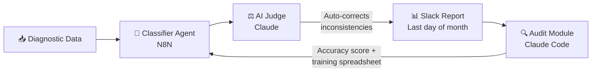
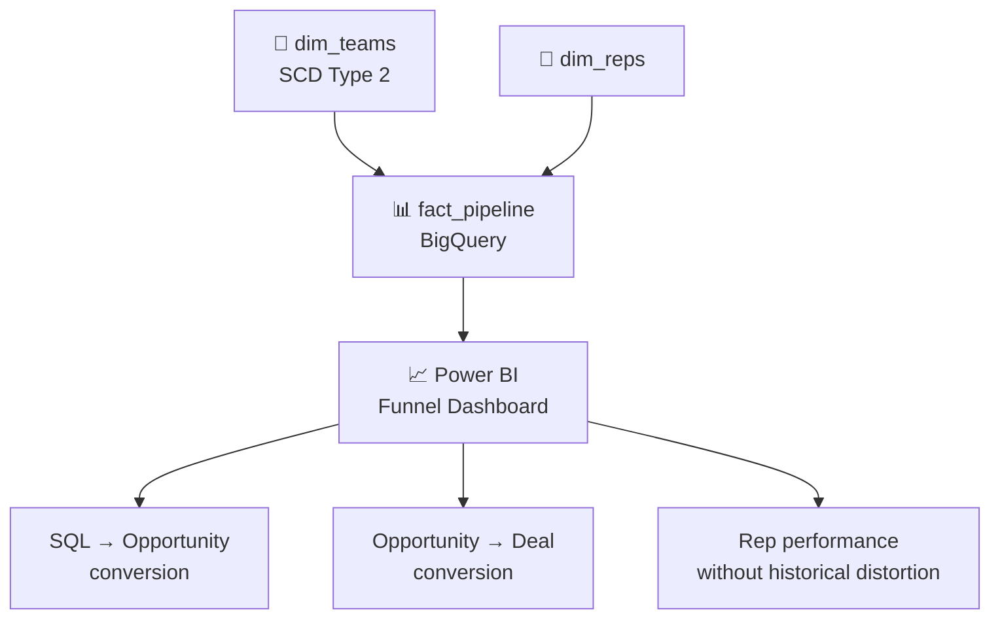

# Helena Callado

### Analytics Engineer · DataOps & AI Automation · Revenue Operations

*I don't build dashboards. I build systems that turn data into decisions — and decisions into revenue.*

---

## About Me

I'm an Analytics Engineer and Revenue Ops practitioner based in Florianópolis, currently at **Asksuite** — a B2B SaaS company in the hospitality sector. My work lives at the intersection of data engineering and business operations: I model data, build pipelines, and wire up AI automations that make the revenue machine run faster and more reliably.

What sets my work apart is context. I don't just apply frameworks — I understand why a churn driver matters, how a historical distortion corrupts pipeline analysis, and what "good data" actually means for a CS team tracking health scores. That business lens shapes every technical decision I make.

Before data, I taught martial arts. That background shows up in how I work: methodical, iterative, and focused on long-term form over short-term wins.

> [!NOTE]
> I'm actively building toward a career in **Data Engineering and Analytics Engineering**, with focus on scalable pipelines, robust data models, and systems that improve themselves over time.

---

## Tech Stack

**Languages & Query**

**BI & Analytics**

**Cloud & Data Infrastructure**

**Automation & AI**

---

## Projects

### 🔁 Churn Report Automation — N8N + Claude Code

> [!IMPORTANT]
> This pipeline eliminated a 5-day manual process and replaced it with a self-improving monthly automation — no human intervention required after deploy.

**The system flow:**

📋 Full technical details

**Problem:** The churn report took up to 5 days to complete, relying on manual classification of customer diagnostics.

**Solution:**
- **Classifier Agent** (N8N): reads diagnostic data and maps churn drivers automatically
- **AI Judge** (Claude): reviews outputs and auto-corrects inconsistencies before delivery
- **Output**: delivered to Slack every last day of the month with saver funnel, top drivers, executive summary, and MoM analysis

**Self-improvement layer:** An audit module via Claude Code calculates classification accuracy, surfaces errors, and generates a training spreadsheet — the system gets smarter with every cycle without human intervention.

**Result:** Eliminated recurring manual work. Built a closed feedback loop that continuously improves model accuracy.

---

### 📊 Sales Dashboard Rebuild — SCD Type 2 + BigQuery + Power BI

> [!TIP]
> If your dashboard doesn't handle organizational changes correctly, your historical metrics are lying to you. SCD Type 2 fixes that.

**Data model architecture:**

📋 Full technical details

**Problem:** The existing sales funnel dashboard had no correct organizational history — team restructures corrupted historical conversion data.

**Solution:** Full redesign with **SCD Type 2** modeling on the team dimension in BigQuery:
- Optimized queries across the entire data model
- Cleaner layout surfacing SQL → Opportunity → Deal conversion rates
- No historical distortion from team restructures

**Result:** Reliable pipeline analysis, accurate rep-level performance tracking, and a dashboard leadership can trust over time.

---

### 🤖 Power BI + Claude via Microsoft MCP

> [!IMPORTANT]
> Reduced board-level data audit time from **20+ hours/month to ~10 hours/month**. Audits now happen in natural language with full evidence trail.

📋 Full technical details

**Problem:** Board-level reporting required 20+ hours/month of manual data audits before any number could be trusted.

**Solution:** Integrated Claude directly into the Power BI semantic model via **Microsoft MCP**, with business logic injected (NRC, MRR, CS funnel):
- Audits surface the exact table, field, value, and business context behind any discrepancy
- DAX measures generated from plain-language requirements
- Business logic (NRC, MRR, CS funnel) injected directly into the model

**Result:** Audit time cut in half. The team spends less time checking data and more time acting on it.

---

### 📈 Events Dashboard with Payback Analysis

📋 Details

Built a dashboard connecting user behavior to financial impact — funnel conversion, payback structure (time to recover investment), and a single source of truth for product and business teams.

Changed the internal question from *"how many users?"* to *"which initiatives actually pay off?"*

---

### 🧩 Clay AI — GTM Data Enrichment at Scale

📋 Details

Automated data enrichment, segmentation, and AI-powered outbound workflows using Clay AI.

- Data governance implemented across **600K+ rows**
- Improved quality and transparency for global GTM teams
- Dashboard adoption increased **80%** after the revamp

---

## How I Think About Data

> [!NOTE]
> These are the principles that shape every model, pipeline, and automation I build.

- **Data without business context doesn't generate decisions** — it generates confusion. Every model I build starts with: *what will someone actually do with this?*
- **Real automation includes the feedback loop** — a pipeline that runs but never improves is just deferred manual work. I build systems that audit themselves.
- **Historical accuracy is not optional** — if your data model doesn't handle organizational changes correctly, your metrics are lying to you.
- **Frameworks fail without context** — RevOps playbooks, data mesh principles, agile sprints: all useful, all wrong when applied without understanding the specific business reality.

---

## Currently Building

> [!TIP]
> Open to conversations about data architecture, Revenue Ops, and agentic AI systems.

- 🏗️ **Agentic data systems** — multi-agent workflows with closed feedback loops
- 🔧 **ETL pipeline architecture** — structured ingestion, transformation, and delivery at scale
- 📚 **Data Engineering fundamentals** — orchestration, data contracts, pipeline observability
- 🎙️ **Sharing publicly** — technical content on RevOps + data engineering for the Portuguese-speaking data community

---

## Connect

---

UFSC · Sistemas de Informação · Florianópolis, SC

